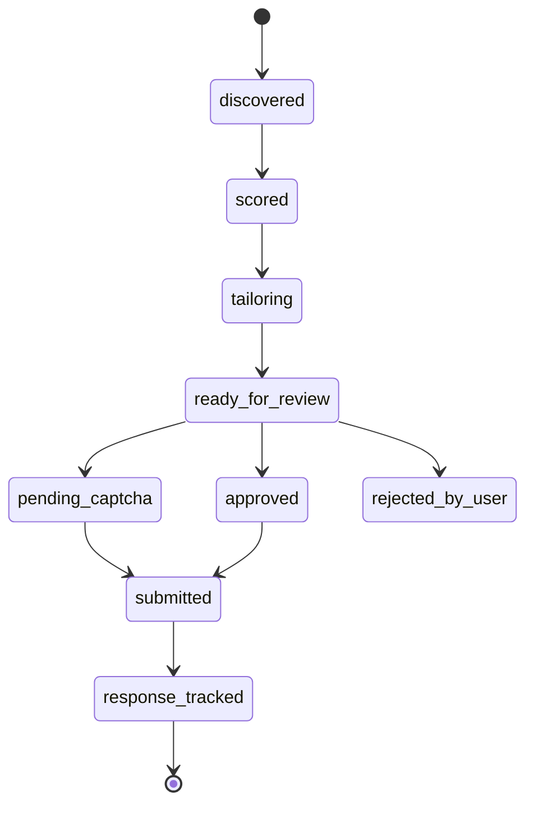

# AutoApply — Automated Job Application Pipeline

*Working title — rename freely. This doc defines MVP scope, architecture, folder structure, and the production practices baked into the build (testing, CI/CD, observability, evals).*

## 1. One-line pitch

A pipeline that discovers jobs matching a student's skills, scores and prioritizes them, generates a tailored resume + draft answers per posting, then queues each application for a one-click human review-and-submit — with CAPTCHA-blocked applications routed to a dedicated pending list instead of being silently dropped or hacked around.

## 2. Tech stack

| Layer | Choice | Why |
|---|---|---|
| Backend API | FastAPI (Python, async) | Matches existing experience; async-native fits Playwright + Celery well |
| Frontend | Next.js (App Router) | SSR dashboard, clean separation from the API |
| Database | PostgreSQL + SQLAlchemy (async) + Alembic | Relational state machine + JSONB for flexible JD/resume fields |
| Task queue | Celery + Redis | Industry-standard async job processing for discovery/scoring/tailoring |
| Browser automation | Playwright (Python, async) | Modern JS-heavy ATS support, first-class async API |
| LLM | Claude API (primary), OpenAI as fallback via provider-agnostic gateway | Reuses your existing gateway pattern from the Shopify assistant |
| Containerization | Docker + docker-compose (local), single compose or lightweight orchestrator (prod) | Matches existing Docker experience |
| CI/CD | GitHub Actions | Free, ubiquitous, easy to demo |
| Observability | Structured JSON logs + correlation IDs; optional OpenTelemetry traces later | New skill area, deliberately built in from day one |

## 3. MVP scope

**In scope for v1:**
- Job discovery from a small, fixed set of sources (start with 1–2 official APIs/feeds — avoid raw scraping of platforms that prohibit it)
- Skill/fit scoring (embedding similarity between profile and JD, weighted by user-set priorities)
- Resume tailoring (LLM rewrites bullets/summary per JD, grounded only in the user's real experience — no fabrication)
- Draft answers for common free-text application questions
- Playwright-driven form fill for 2–3 target ATS platforms (adapters) + a generic LLM-vision fallback for others
- Review screen: one job at a time, shows filled fields + draft answers, editable, single "approve" action
- Pending-submission queue for anything that hits a CAPTCHA or login wall — user finishes it manually from a flagged list
- Basic analytics: funnel (applied → response → interview), time saved, resume-variant response rate

**Explicitly deferred (not v1):**
- Multi-user / multi-tenant support (single-user first, design the schema so it's not painful to add later)
- Auto-discovery across every possible job board — start narrow, prove the pipeline, then widen
- Fully unattended submission (submission always requires the human click, by design — this is a feature, not a limitation to remove later)
- Mobile app / notifications beyond the dashboard

## 4. Core pipeline (state machine)

Every job application is one row moving through explicit states — this is also the backbone of your analytics.

```
discovered → scored → tailoring → ready_for_review → approved → submitted → response_tracked
                                        ↓
                                 pending_captcha  (manual finish, then → submitted)
                                        ↓
                                   rejected_by_user (dropped, still logged for analytics)
```



## 5. Folder structure

Monorepo, two deployable apps, shared docs/CI at the root.

```
autoapply/
├── backend/
│   ├── app/
│   │   ├── main.py
│   │   ├── core/
│   │   │   ├── config.py          # env-driven settings (pydantic-settings)
│   │   │   ├── security.py        # credential encryption, auth
│   │   │   └── logging.py         # structured JSON logging setup
│   │   ├── api/
│   │   │   └── v1/
│   │   │       ├── routers/       # jobs.py, applications.py, resumes.py, analytics.py
│   │   │       └── deps.py
│   │   ├── models/                # SQLAlchemy ORM models
│   │   ├── schemas/                # Pydantic request/response schemas
│   │   ├── services/
│   │   │   ├── discovery/          # job source adapters
│   │   │   ├── scoring/            # embedding + fit scoring
│   │   │   ├── tailoring/          # resume + answer generation
│   │   │   └── llm_gateway/        # provider-agnostic LLM client
│   │   ├── automation/
│   │   │   ├── base.py             # adapter interface
│   │   │   ├── adapters/           # workday.py, greenhouse.py, lever.py
│   │   │   └── generic_llm_filler.py
│   │   ├── workers/
│   │   │   ├── celery_app.py
│   │   │   └── tasks/              # discover_task.py, score_task.py, tailor_task.py
│   │   └── db/
│   │       ├── session.py
│   │       └── migrations/         # Alembic
│   ├── evals/
│   │   ├── datasets/                # labeled fit-score pairs, tailoring before/after
│   │   └── run_eval.py
│   ├── tests/
│   │   ├── unit/                    # scoring, state machine, pure logic
│   │   ├── integration/             # API + DB
│   │   └── fixtures/
│   │       └── ats_snapshots/       # saved HTML of real ATS forms, sanitized
│   ├── alembic.ini
│   ├── pyproject.toml
│   └── Dockerfile
│
├── frontend/
│   ├── app/
│   │   ├── applications/            # kanban-style pipeline view
│   │   ├── review/                  # one-click review + approve screen
│   │   ├── pending/                 # CAPTCHA/manual-finish queue
│   │   └── analytics/
│   ├── components/
│   ├── lib/
│   ├── tests/
│   └── Dockerfile
│
├── docs/
│   └── adr/                          # architecture decision records, one per major choice
│
├── .github/
│   └── workflows/
│       ├── ci.yml                    # lint + typecheck + tests on every PR
│       └── deploy.yml                # build image, push, deploy staging on merge to main
│
├── docker-compose.yml                 # postgres, redis, backend, worker, frontend
├── .env.example
└── README.md
```

## 6. Production practices baked into the MVP

**Testing**
- Unit tests for everything deterministic: scoring math, state transitions, skill-gap aggregation — no LLM calls, fast, real coverage
- Fixture-based tests for the form filler: sanitized HTML snapshots of real ATS forms in `tests/fixtures/ats_snapshots/`, asserted against on every change — this is your regression suite when an adapter breaks
- Schema/contract tests on every LLM response (Pydantic validation, fail loud on drift)

**CI/CD**
- `ci.yml`: lint + typecheck + full test suite on every PR, blocks merge on failure
- `deploy.yml`: build Docker images on merge to `main`, auto-deploy to staging, manual approval gate before prod

**Logging & observability**
- Structured JSON logs at every pipeline stage, tagged with `application_id` as a correlation ID so one job's full journey is traceable across discovery → scoring → tailoring → submission
- Per-stage latency and LLM cost tracked and exposed as metrics (reuse your microdollar-cost-accounting instinct from the Shopify project)
- These metrics double as analytics-dashboard data — no separate system needed

**Eval harness**
- Labeled eval set: (job, profile) → human-judged fit score, used to check the scorer's ranking against real judgment, not just "looks reasonable"
- Before/after eval on tailoring: does the tailored resume score higher on keyword/ATS match than the untailored baseline
- Form-fill accuracy as a tracked metric against the fixture set, over time

**Secrets & security**
- Job-portal credentials encrypted at rest, never logged, short-lived sessions where possible
- All API keys/secrets via env vars + `.env.example` committed (never real secrets)

**Resilience**
- Idempotent retries with backoff on all browser-automation steps (page loads, element waits) — these fail transiently by nature, don't treat a first failure as final
- Rate limiting / backoff on all external calls (LLM APIs, job source APIs) — don't get your own accounts blocked

## 7. Areas that need extra attention

These are the parts most likely to break, mislead, or bite you — budget real time here, not just at the end.

- **ATS adapter fragility** — Workday/Greenhouse/Lever update their DOM structure periodically. The fixture-based regression tests exist specifically to catch this fast rather than silently failing in production.
- **LLM hallucination in tailoring** — the resume rewriter must never invent experience, metrics, or skills the user doesn't have. Ground every rewrite strictly in the user's existing resume content; treat any output that introduces new claims as a bug, and eval against this explicitly.
- **CAPTCHA/pending-queue UX** — this is your key differentiator, so the pending list needs to be genuinely fast to clear (clear context on *why* it's pending, one click into the exact form state), not just a dumping ground of stuck applications.
- **Platform ToS and request volume** — prefer official APIs over scraping wherever they exist; keep request rates human-scale; this is a single-user personal tool, not a scraper — design and document it that way.
- **Credential storage** — this is the one part of the project where a real security mistake has real consequences (someone's job-portal login). Don't treat encryption-at-rest as optional or "add later."
- **Cost control on LLM calls** — tailoring + scoring + draft answers all cost money per job; cap per-run spend and surface cost in the analytics view so it doesn't silently run up a bill during a busy application week.

## 8. Phased roadmap

1. **Scaffold** — repo structure, docker-compose (Postgres, Redis), FastAPI skeleton, Next.js skeleton, CI running on empty test suite
2. **Discovery + scoring** — one job source integrated, embedding-based fit scoring, unit tests + first eval dataset
3. **Tailoring** — resume rewrite + draft answers, hallucination-guardrail eval, before/after tailoring eval
4. **Automation + review** — Playwright adapters for 2–3 platforms, generic LLM fallback, fixture tests, the review screen, pending-CAPTCHA queue
5. **Analytics** — funnel, resume-variant response rate, skill-gap view, cost/latency dashboards
6. **Hardening** — fill remaining test coverage, finalize CI/CD deploy gate, structured logging pass, ADRs written up

## 9. Open decisions still pending

- Job source(s) for v1 discovery — which official API/feed to start with
- Single-user auth approach (simple session vs. something heavier — likely overkill for v1)
- Deployment target (Docker Compose on a single VM is enough for v1; no need for k8s)
